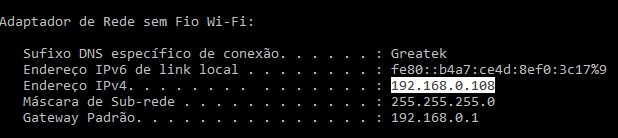

## ⚙️ Configurações Antes de Executar
Antes de executar o app, é importante configurar o `json-server` do projeto para rodar na sua máquina. Isso será necessário já que endereço de localhost não é compatível entre o emulador e a máquina que está executando.


1. Para descobrir um **ip** válido na sua máquina, no windows, execute o comando:
```
$ ipconfig
```
2. O Windows irá exibir uma lista de ip's válidos na sua máquina. Você deve copiar o Endereço ``IPv4``. 




3. Localize o arquivo 
``./server/config.json``

4. No valor de `host` do json coloque o ip copiado anteriormente e salve o arquivo.
   
5. Por fim, devemos informar ao App o novo endereço do servidor.
   
6. Localize o arquivo ``./src/services/api.ts``.
   
7. Na constante IP, atribua o valor do ip copado anteriormente e salve o arquivo.

<br>

## 🏁 Executando Servidor e App
Para realizar a execução você deve primeiramente instalar as dependências com o comando:
```
$ yarn install
```

Com as dependências instaladas, já é possível iniciar o servidor com o comando:
```
$ yarn server
```

Para executar o expo, em um segundo terminal use o comando:
```
$ expo start
```

## Credenciais
Existem 3 usuários registrados na api para teste. Use essas credenciais de login e senha para acessar o app. [Você pode ver os dados nesse aquivo]().


## 📷 Previews
<div align="center">
  <div style="display: flex; justify-content: center; flex-wrap: wrap; gap: 8px;">
    
    
  </div>
</div>

